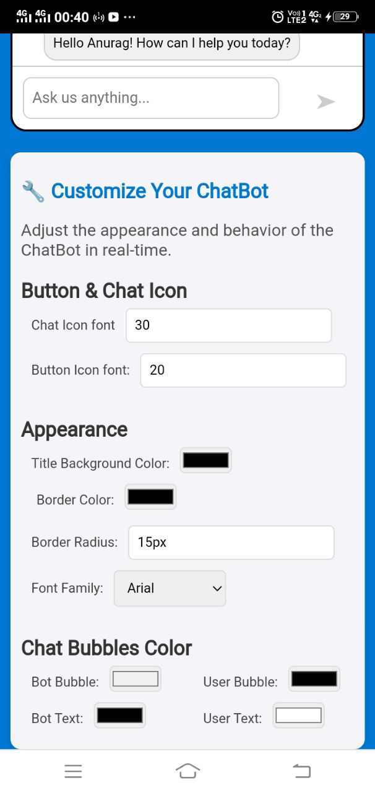

## Customizable Chatbot Application
This project is a responsive customizable chatbot application that allows users to adjust various visual elements of the chatbot interface in real-time. It is built with React and includes features like customizable chat bubbles, title bar, and fonts. The layout is fully responsive for both desktop and mobile devices.

# Features
- Customizable Chatbot UI:

1. Change the title bar background color and border color.
2. Adjust border radius for rounded corners.
3. Customize chat bubble colors and text colors for both user and bot.
4. Update fonts used across the application.
5. Resize button icons and chat icons dynamically.

- Responsive Design:
1. Desktop, tablet, and mobile-friendly layout.
2. Chatbot and customization panel adapt seamlessly to different screen sizes.

- Interactive UI:
1. Real-time preview of customization changes.
2. Input fields and color pickers for easy adjustments.

# Table of Contents
- Installation
- Usage
- Project Structure
- Customization Options
- Technologies Used
- License

# Installation
1. Clone the repository:
git clone https://github.com/ayush7078/Jinn-ChatBot-UI.git
cd Jinn-ChatBot-UI

2. Install dependencies: Make sure you have Node.js installed, then run:
npm install

3. Start the development server:
npm start

4. Open your browser and go to:
http://localhost:3000

# Usage
1. Customize the Chatbot:
- Use the panel on the left to adjust settings like colors, border radius, and font styles.
- The changes will reflect instantly in the chatbot preview on the right.

2. Test Responsiveness:
- Resize your browser window or test on different devices to see the responsive layout in action.

# Project Structure
- ├── public
- │   ├── index.html
- │   └── favicon.ico
- ├── src
- │   ├── components
- │   │   ├── ChatBot.js          # Chatbot Component
- │   │   ├── CustomizationPanel.js # Customization Panel Component
- │   ├── App.css                 # Styles
- │   ├── App.js                  # Main Application
- │   ├── index.js                # Entry Point
- ├── README.md                   # Documentation
- ├── package.json                # Project Metadata
- └── node_modules                # Dependencies

# Customization Options
The chatbot's appearance can be customized using the following parameters:

1. Title Bar:
- Background color
- Border color
- Border radius

2. Chat Bubbles:
- Bot bubble background color
- Bot text color
- User bubble background color
- User text color

3. Icons:
- Chat icon font size
- Button icon font size

4. Font Styles:
- Select from predefined fonts (Arial, Verdana, Courier New, etc.).

# Technologies Used
- React: Component-based front-end library.
- CSS: Custom styles for responsiveness and theming.
- HTML: Structuring the UI.

# Contributing
Contributions, issues, and feature requests are welcome!
Feel free to check the issues page.

# License
This project is licensed under the MIT License. See the LICENSE file for details.

# Screenshots
### Desktop View

### Mobile View

